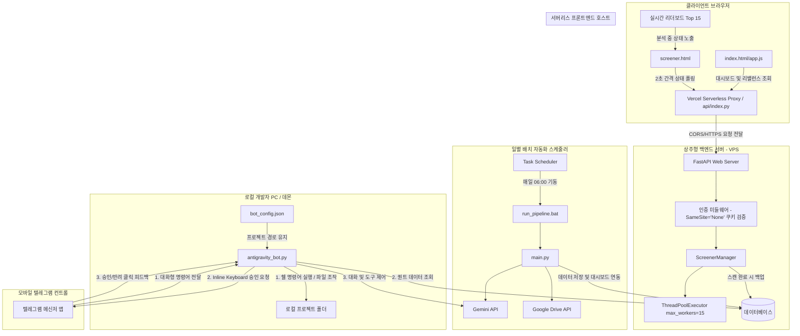
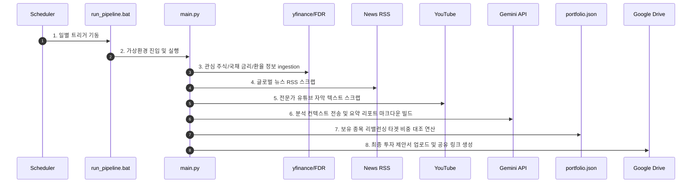

# 주식 발굴 및 포트폴리오 리밸런싱 시스템: 전체 구조 설계서

본 문서는 주식 추천 및 자산 배분 시스템의 전체 소프트웨어 아키텍처, 네트워크 연동 흐름, 그리고 컴포넌트 간 관계를 기술합니다. 해당 시스템은 크게 **일별 배치 자동화 파이프라인**과 **웹 서버 기반 실시간 스크리너** 두 영역으로 분리되어 있으며, 상주형 VPS(Cafe24)와 서버리스 프론트엔드(Vercel) 간 협동 구조로 구동됩니다.

---

## 1. 하이글로벌 시스템 구조도 (High-Level Overview)

전체 시스템은 다음과 같은 논리적 흐름으로 구성되며, PPTX 설계 파워포인트로 시각화되어 [system_architecture.pptx](file:///c:/Users/samsung/proj/stockRecommend/docs/1_architecture/system_architecture.pptx)에 수록되어 있습니다.

---

## 2. 일별 자동화 파이프라인 (Daily Batch Pipeline)

매일 정해진 시각(오전 6시)에 작동하여 거시 경제 데이터, 전문가 의견, 뉴스 RSS 피드를 수집하고 자산 비중 리밸런싱 추천 리포트를 생성 및 업로드합니다.

### 데이터 흐름도

---

## 3. 웹 서버 및 스크리너 실시간 연동 (Web Server & Screener)

사용자가 주식 스크리너 화면(`screener.html`)에서 실시간 스캔을 시작할 때 작동하는 백엔드-프론트엔드 실시간 연동 아키텍처입니다.

### 연동 핵심 설계 정책
1. **폴링 간격 (2.0초)**: 백엔드의 CPU 병렬 퀀트 연산 부하와 네트워크 전송 낭비를 방지하기 위해 조회 폴링 주기를 2.0초로 제한합니다.
2. **실시간 리더보드 (Top 15)**: 백엔드가 500개 종목을 스레드 풀(15개 워커)로 계산하는 동안, 프론트엔드는 분석 완료된 종목들만 실시간 정렬하여 상위 15개 리더보드만 테이블에 출력함으로써 브라우저 프리징(DOM Overload)을 원천 차단합니다.
3. **완료 후 일괄 로드**: 백그라운드 분석이 종료(`status === 'done'`)되면 전체 종목 결과를 프론트엔드 테이블에 바인딩하여 정렬 및 다중 검색을 지원합니다.
4. **쿠키 연동 (SameSite None, Secure)**: HTTPS 배포 환경에서 Vercel의 프론트엔드가 Cafe24 백엔드를 호출할 때 크로스사이트(Cross-Site) 인증 쿠키 `auth_token`이 온전히 전송될 수 있도록 보안 쿠키 정책을 동적으로 적용합니다.

### 컴포넌트 맵핑
* **[screener.html](file:///c:/Users/samsung/proj/stockRecommend/app/static/screener.html)**: 2.0초 비동기 폴링 수신기 및 실시간 리더보드 렌더링 뷰.
* **[web_server.py](file:///c:/Users/samsung/proj/stockRecommend/app/web_server.py)**: Uvicorn 호스팅, SameSite None 로그인 제어, 단일 중복 제거 API 라우트 관리.
* **[screener.py](file:///c:/Users/samsung/proj/stockRecommend/app/screener.py)**: 백그라운드 워커 스레드 제어, yfinance 100종 묶음 다운로드 및 ThreadPoolExecutor(15개 스레드) 스캔 제어.
* **[scoring.py](file:///c:/Users/samsung/proj/stockRecommend/app/scoring.py)**: yfinance info 정보(PER, PEG, EPS, Canslim) 기반 상대 퀀트 점수 산출 로직.

---

## 4. 물리 배포 아키텍처 (Deployment Structure)

* **프론트엔드 (Vercel)**:
  - 서버리스 아키텍처로 가동 비용이 없고 글로벌 CDN을 통해 정적 웹 리소스를 제공합니다.
  - Vercel의 제한으로 인해 실시간 상주 스레드 연산(Screener Worker)은 불가능하므로, 백엔드 로직 호출은 원격 Cafe24 VPS를 바라보게 설정합니다.
* **백엔드 (Cafe24 VPS)**:
  - Linux 기반 고정 IP 서버에서 Uvicorn/FastAPI 프로세스가 365일 상주합니다.
  - 백그라운드 스레드 및 데이터베이스(RDBMS) 저장이 보장되어 스크리너 및 리밸런싱 로직을 안정적으로 수행합니다.
* **로컬 데몬 (Developer PC)**:
  - Antigravity 2.0 텔레그램 에이전트 봇이 상주 기동되어 모바일 텔레그램 메신저와 개발자 로컬 워크스페이스 간의 가교 역할을 수행합니다.
  - 봇은 쉘 명령어 실행, 에이전트 파일 변경 등 보안 위협이 따르는 핵심 액션을 실행하기 전 사용자에게 원격 대화형 승인을 요구합니다.

---

## 5. 전체 시스템 구현 기능 명세표 (Implemented Feature Matrix)

본 주식 분석 및 포트폴리오 관리 시스템에 실제로 구현 및 반영되어 안정적으로 동작하고 있는 모든 기능 목록입니다. 각 기능의 세부 구현 매핑과 소스 파일 구성은 [구현 기능 명세서](file:///c:/Users/samsung/proj/stockRecommend/docs/1_architecture/implemented_features.md)를 참조하십시오.

| 대분류 (Category) | 중분류 (Sub-category) | 세부 기능 및 사양 (Feature Details) | 구현 상태 (Status) |
| :--- | :--- | :--- | :---: |
| **투자 분석 자동 파이프라인** *(Batch Pipeline)* | 거시경제 & 가격 수집 | - yfinance / FinanceDataReader 기반 관심 주식, 미국채 10년물 금리, 환율 수집 - Google, Yahoo, Naver News RSS 피드 수집 및 파싱 | **완료 (구현)** |
| | 유튜브 전문가 자막 분석 | - target 채널의 최신 동영상 자동 감지 및 자막 수집 - Gemini API를 이용한 요약 및 리밸런싱 근거 자료 추출 | **완료 (구현)** |
| | 리포트 생성 및 배포 | - 일별 투자 요약 리포트 마크다운(Markdown) 자동 작성 - 구글 드라이브 API 연동 및 서비스 계정 공유 폴더 자동 업로드 | **완료 (구현)** |
| | 일일 텔레그램 브리핑 | - 매일 아침 08:00 KOSPI/S&P500 최상위 5종목 추천 브리핑 알림 전송 | **완료 (구현)** |
| **웹 대시보드** *(Web Dashboard)* | 반응형 프리미엄 UI | - HSL 네온 테크 테마 스타일 토큰 및 Glassmorphism 반투명 카드 뷰 - Chart.js Canvas Linear Gradient를 적용한 네온 자산 비중 시각화 | **완료 (구현)** |
| | 통합 자산 관리 테이블 | - 일반 주식 계좌와 개인 연금 계좌(`연금매매일지`) 보유 자산 파싱 통합 - HSL 기반 전용 Badge(.badge-stock: Cyan, .badge-pension: Amber) 표시 | **완료 (구현)** |
| | 실시간 거시 지표 연동 | - open.er-api 기반 USD/KRW 환율 실시간 자동 계산 및 렌더링 - yfinance `fast_info` 기반 실시간 KOSPI & S&P 500 종가 및 등락률 표시 - 강력한 브라우저 캐싱 방지를 위한 전체 GET API 타임스탬프(`?_t=`) 강제 적용 | **완료 (구현)** |
| | AI 리밸런싱 컨설턴트 | - Gemini 기반 현재 자산 배분 비중 분석 및 BUY/SELL/HOLD 상세 전략 도출 - Cooldown 13초 게이지 타이머 및 로딩 간 CLS 방지 스켈레톤 로더 적용 | **완료 (구현)** |
| **실시간 주식 스크리너** *(Stock Screener)* | 병렬 분석 스크리너 | - ThreadPoolExecutor(15개 스레드) 기반 KOSPI 200, KOSDAQ, S&P 500 전수 검사 - CANSLIM 계량 투자 Scoring 퀀트 규칙 구현 및 DB 기록 백업 | **완료 (구현)** |
| | 실시간 폴링 및 리더보드 | - 2.0초 비동기 폴링 수신기 기반 실시간 스캔 정보 표출 - 스캔 진행 중 DOM 부하를 줄이기 위한 실시간 리더보드(Top 15) 렌더링 | **완료 (구현)** |
| **텔레그램 원격 제어** *(Telegram Control)* | 실시간 지표 & 상태 조회 | - `/system` (PC 리소스 조회), `/status` (스크리너 진행 상태 조회) - `/screener` (시장별 스캔 결과 Top 10), `/score <티커>` (퀀트 점수) | **완료 (구현)** |
| | 원격 명령어 & 에이전트 | - `/cmd <명령>`: 로컬 터미널의 cmd 명령 직접 연동 및 아웃풋 수신 - `/chat <지시>`: Antigravity AI 코딩 에이전트 구동 및 자동 도구 실행 | **완료 (구현)** |
| | **대화형 원격 안전 승인** | - 파일 쓰기(`write_file`), 도구 실행(`run_command`), 터미널 명령어(`/cmd`) 수행 전 텔레그램 인라인 키보드(`[✅ 승인]`, `[❌ 반려]`) 동의 대기 - 비동기 루프를 차단하지 않는 스레드 안전 `threading.Event()` 기반 차단 | **완료 (구현)** |
| | **프로젝트 동적 전환** | - `/project [경로]` 명령어 지원 (봇의 활성 워크스페이스 위치 영구 전환) - 프로젝트 전환 시 `.env`, `sys.path`, DB 세션, Gemini 모델 자동 리로드 | **완료 (구현)** |
| | **마크다운 파싱 예외 처리** | - 마크다운 문법 유실 등으로 인한 API 에러 방지용 `safe_` 메시지 래퍼 구현 - 파싱 오류 감지 시 즉시 평문(`parse_mode=None`)으로 자동 전환 전송 | **완료 (구현)** |
