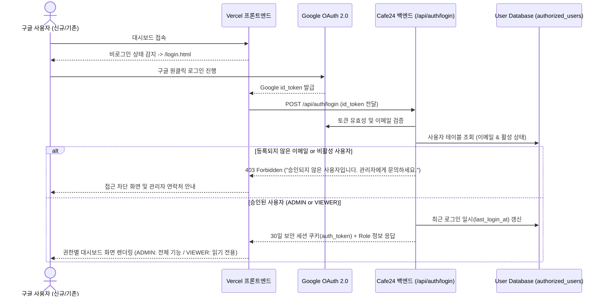

# 👥 다중 사용자 인가 및 권한 관리 시스템 설계서 (Multi-User Auth & RBAC Design)

본 문서는 `stockRecommend` 시스템을 복수의 사용자(가족, 공동 투자자, 팀원 등)가 안전하게 접속하여 사용할 수 있도록 지원하는 **다중 사용자 화이트리스트 및 역할 기반 접근 제어(RBAC: Role-Based Access Control) 시스템**의 상세 설계서입니다.

---

## 🎯 1. 기능 목표 및 핵심 원칙 (Core Principles)

1. **단일 관리자(Master Admin) & 100% 순수 조회 전용 사용자(Zero-Execution Viewers)**:
   - 👑 **관리자 (`bumhyun.lim@gmail.com`)**: 시스템 제어, 온디맨드 파이프라인 가동, AI 리밸런싱 생성, API/모델 설정, 사용자 관리 등 **유일한 실행 권한자**.
   - 👁️ **추가 사용자 (전원 순수 조회 전용)**: 추가되는 모든 사용자는 **100% 읽기 전용(Read-Only)**으로 동작하며, 시스템 상태나 API 호출을 유발하는 어떠한 동작도 수행할 수 없음.
2. **이중 잠금 보안 (UI 숨김 + 백엔드 API 403 차단)**:
   - 프론트엔드 UI에서 실행 버튼(분석 시작, 리밸런싱 생성, 설정 등)을 완전히 숨기거나 비활성화할 뿐만 아니라,
   - 백엔드 REST API 레이어에서도 관리자가 아닌 사용자의 모든 쓰기/실행 요청(`POST`, `PUT`, `DELETE`)을 `403 Forbidden (Read-Only Account)`으로 엄격히 원천 차단.
3. **간편한 사용자 화이트리스트 관리**:
   - 관리자 화면에서 구글 이메일만 등록하면 해당 사용자는 로그인 후 즉시 대시보드를 자유롭게 열람 가능.

---

## 🏗️ 2. 시스템 아키텍처 및 인증 플로우



---

## 📊 3. 데이터베이스 스키마 설계

`stock_db` 내에 사용자 관리 전용 테이블 `authorized_users`를 정의합니다.

```sql
CREATE TABLE IF NOT EXISTS authorized_users (
    id INTEGER PRIMARY KEY AUTOINCREMENT,
    email VARCHAR(100) NOT NULL UNIQUE,          -- 구글 이메일 (소문자 정규화)
    name VARCHAR(100),                          -- 사용자 이름/별칭
    role VARCHAR(20) NOT NULL DEFAULT 'VIEWER',  -- 'ADMIN' 또는 'VIEWER'
    is_active BOOLEAN NOT NULL DEFAULT 1,       -- 1: 활성, 0: 접근 차단
    created_at TIMESTAMP DEFAULT CURRENT_TIMESTAMP,
    last_login_at TIMESTAMP NULL
);

-- 초기 기본 관리자 계정 시드 데이터
INSERT OR IGNORE INTO authorized_users (email, name, role, is_active)
VALUES ('bumhyun.lim@gmail.com', 'BH LIM (시스템 관리자)', 'ADMIN', 1);
```

---

## 🛡️ 4. 권한별 접근 제어 매트릭스 (RBAC Matrix)

| 구분 | 주요 기능 및 API | 관리자 (ADMIN) | 조회자 (VIEWER) | 비로그인 / 차단 |
| :--- | :--- | :---: | :---: | :---: |
| **대시보드 조회** | 실시간 포트폴리오 현황, 비중 차트, 거시경제 지표 | ✅ 허용 | ✅ 허용 | ❌ 차단 |
| **스크리너 조회** | CANSLIM 퀀트 스코어링 순위, 20일 추세선 | ✅ 허용 | ✅ 허용 | ❌ 차단 |
| **리포트 검색** | 과거 71개 리포트 키워드 전문 검색 및 열람 | ✅ 허용 | ✅ 허용 | ❌ 차단 |
| **파이프라인 실행** | `POST /api/pipeline/run` (온디맨드 실시간 분석) | ✅ 허용 | ❌ 비활성화 (버튼 숨김) | ❌ 차단 |
| **리밸런싱 생성** | `POST /api/portfolio/rebalance` (AI 전략 생성) | ✅ 허용 | ❌ 비활성화 (버튼 숨김) | ❌ 차단 |
| **시스템 설정** | Gemini 모델 선택, DB 설정, API 키 관리 | ✅ 허용 | ❌ 비활성화 | ❌ 차단 |
| **사용자 관리** | 신규 사용자 초대, 권한 변경, 계정 차단 | ✅ 허용 | ❌ 메뉴 미표시 | ❌ 차단 |

---

## 🔌 5. 백엔드 API 명세 (FastAPI)

### 1) 현재 로그인 사용자 정보 조회
* **`GET /api/auth/me`**
* **Response**:
  ```json
  {
    "email": "bumhyun.lim@gmail.com",
    "name": "BH LIM (시스템 관리자)",
    "role": "ADMIN",
    "is_active": true
  }
  ```

### 2) 사용자 목록 조회 (관리자 전용)
* **`GET /api/users`**
* **권한**: `ADMIN`
* **Response**:
  ```json
  [
    {"id": 1, "email": "bumhyun.lim@gmail.com", "name": "BH LIM", "role": "ADMIN", "is_active": true, "last_login_at": "2026-08-23 18:30:00"},
    {"id": 2, "email": "family_member@gmail.com", "name": "가족 계정", "role": "VIEWER", "is_active": true, "last_login_at": null}
  ]
  ```

### 3) 사용자 추가 / 초대 (관리자 전용)
* **`POST /api/users`**
* **권한**: `ADMIN`
* **Payload**:
  ```json
  {
    "email": "partner@gmail.com",
    "name": "공동 투자자",
    "role": "VIEWER"
  }
  ```

### 4) 사용자 권한 수정 및 활성/비활성화 (관리자 전용)
* **`PUT /api/users/{id}`**
* **권한**: `ADMIN`
* **Payload**: `{"role": "ADMIN", "is_active": true}`

### 5) 사용자 삭제 (관리자 전용)
* **`DELETE /api/users/{id}`**
* **권한**: `ADMIN`

---

## 💻 6. 프론트엔드 UI 화면 기획

1. **헤더 사용자 프로필 바 (Top Navigation)**:
   - 로그인된 사용자 이메일 및 뱃지 표시 (`👤 bumhyun.lim@gmail.com` `[👑 관리자]`)
   - `로그아웃` 버튼 제공
2. **조회자(VIEWER) 뷰 모드**:
   - `지금 분석 시작하기` 및 `AI 리밸런싱 전략 생성` 버튼에 `👁️ 조회 권한 전용` 툴팁 표시 및 비활성화
3. **설정 모달 내 👥 사용자 관리 탭 (ADMIN 전용)**:
   - 등록된 사용자 목록 테이블 (이메일, 이름, 역할, 상태, 최근 접속일)
   - `+ 신규 사용자 추가` 폼 (이메일, 이름, 권한 선택)
   - 권한 변경 드롭다운 (`ADMIN` / `VIEWER`) 및 `삭제 / 차단` 버튼

---

## 🔑 7. Google Cloud Console 설정 가이드 (중요!)

새로운 사용자가 구글 로그인 시 Google의 보안 차단 창이 뜨지 않도록 하기 위한 단계:

1. **OAuth 동의 화면(Consent Screen) 상태 확인**:
   - **상태가 'Testing'인 경우**: Google Cloud Console &rarr; **API 및 서비스** &rarr; **OAuth 동의 화면** &rarr; **Test users(테스트 사용자)**에 추가하려는 모든 구글 이메일(`partner@gmail.com` 등)을 사전에 등록해야 합니다.
   - **상태가 'In Production'인 경우**: 테스트 사용자 등록 없이 승인된 데이터베이스 화이트리스트에만 등록되어 있으면 누구나 구글 로그인을 통과할 수 있습니다.
