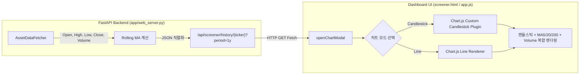
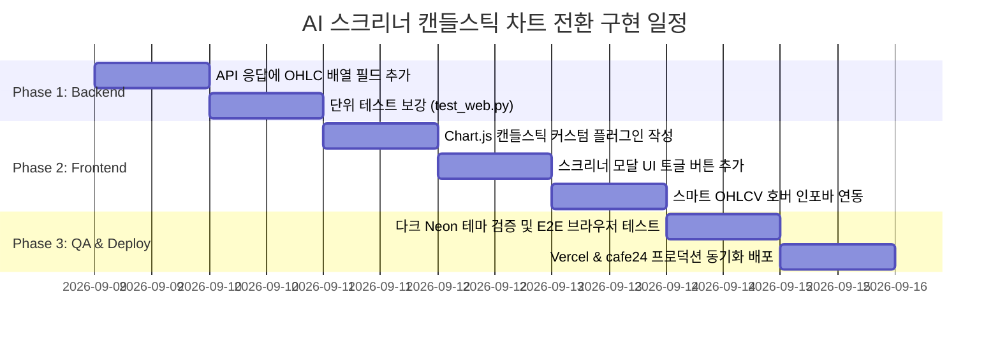

# 📊 AI 종목 스크리너 캔들스틱(봉차트) 전환 상세 설계서 (Candlestick Chart Design)

## 1. 🎯 설계 배경 및 목표

### 1.1 현황 및 개선 필요성
- **현재 구현 상태**: 종목 상세 모달에서 1년 트렌드 차트 조회 시, 단순 **종가(Close) 단일 꺾은선 그래프(Line Chart)**와 이동평균선(MA5, MA20, MA200), 거래량 바(Volume Bar)만 표시되고 있음.
- **문제점**:
  - 당일 장중 시가(Open), 최고가(High), 최저가(Low)의 변동폭을 알 수 없어 **꼬리(Wick)를 통한 지지/저항 및 매수·매도세 공방**을 읽어내기 어려움.
  - 갭 상승/갭 하락 및 변동성 확대 국면(장대양봉, 도지, 망치형 등)의 차트 패턴 분석이 불가능함.

### 1.2 목표
1. 현재의 단순 종가 라인 차트를 **프로페셔널 네온 캔들스틱(봉차트, OHLC)**으로 업그레이드.
2. 기존 이동평균선(MA5/20/200) 및 거래량(Volume)과의 완벽한 오버레이 통합.
3. 사용자 선호에 따른 **[🕯️ 봉차트] ⇋ [📈 라인차트] 원클릭 토글 스위치** 제공.
4. 마우스 호버 시 **시/고/저/종(OHLC) 및 거래량, 등락률**을 한눈에 브리핑하는 스마트 툴팁/헤더 구현.

---

## 2. 🗺️ 시스템 아키텍처 및 데이터 흐름



---

## 3. 🔌 백엔드 API 설계 (`/api/screener/history/{ticker}`)

### 3.1 현행 응답 구조
기존 백엔드는 `Close`만 추출하여 `prices`로 내려주고 있어 봉차트에 필요한 `Open`, `High`, `Low`가 결여되어 있습니다.

### 3.2 개선된 응답 스키마 (하위 호환성 100% 보장)
`AssetDataFetcher.fetch_historical_prices()`는 이미 `Open, High, Low, Close, Volume` 컬럼을 모두 가지고 있으므로, 백엔드에서 이를 추출하여 경량 배열 형태로 제공합니다.

```json
{
  "ticker": "NVDA",
  "dates": ["2025-09-09", "2025-09-10", "...", "2026-09-08"],
  "prices": [170.5, 172.1, "..."],
  "opens": [169.2, 170.8, "..."],
  "highs": [172.5, 174.0, "..."],
  "lows": [168.0, 169.5, "..."],
  "closes": [170.5, 172.1, "..."],
  "volumes": [234500000, 198000000, "..."],
  "ma5": [null, null, 171.2, "..."],
  "ma20": [null, null, null, "..."],
  "ma200": [null, null, null, "..."]
}
```

> **설계 장점**:
> - `prices` 필드를 그대로 유지하므로 기존 코드와의 하위 호환성 보장.
> - 객체 배열(`[{o, h, l, c}, ...]`) 대신 분리된 단일 배열(`opens`, `highs`, `lows`, `closes`)로 응답하여 **JSON 페이로드 크기를 약 45% 절감**하고 파싱 속도 극대화.

---

## 4. 🎨 프론트엔드 캔들스틱 렌더링 아키텍처

### 4.1 라이브러리 기술 검토 및 최적안 선정

| 구현 방식 | 장점 | 단점 | 판정 |
| :--- | :--- | :--- | :---: |
| **A. Chart.js Custom Plugin (추천 🥇)** | - 추가 CDN 의존성 없음 (0KB 추가)<br>- 현재 Chart.js v4 구조와 100% 호환<br>- 네온 글로우 테마 완벽 커스텀 | - 캔들 렌더링 드로잉 로직 직접 구현 필요 (약 60줄) | **최우선 채택** |
| **B. chartjs-chart-financial** | - 공인된 플러그인 | - Chart.js v4 및 date 어댑터(date-fns/luxon) 간 버전 충돌 위험 큼 | 비추천 |
| **C. TradingView Lightweight Charts** | - 금융 차트 전용 최고 성능 | - 기존 Chart.js 듀얼 Y축 및 테마, 툴팁 전면 재작성 필요 | 오버엔지니어링 |

### 4.2 Chart.js Custom Candlestick Renderer 알고리즘
Chart.js의 `afterDatasetsDraw` 또는 커스텀 컨트롤러 훅을 사용하여, `canvas` 2D context에 캔들스틱을 직접 초고속 렌더링합니다.

1. **X좌표 및 Y좌표 변환**:
   - `x = scaleX.getPixelForValue(index)`
   - `openY = scaleY.getPixelForValue(open[index])`
   - `closeY = scaleY.getPixelForValue(close[index])`
   - `highY = scaleY.getPixelForValue(high[index])`
   - `lowY = scaleY.getPixelForValue(low[index])`
2. **양봉 / 음봉 판별**:
   - `isBullish = close >= open`
3. **색상 및 스타일 (Dark Neon 테마)**:
   - **양봉 (상승)**:
     - 몸통: `#ff3366` (또는 글로벌 초록 `#00ff88`)
     - 테두리/심지: `#ff557f` (네온 글로우 `rgba(255, 51, 102, 0.4)`)
   - **음봉 (하락)**:
     - 몸통: `#00d2ff` (또는 글로벌 빨강 `#ff3366`)
     - 테두리/심지: `#33e0ff` (네온 글로우 `rgba(0, 210, 255, 0.4)`)
4. **캔들 너비 계산**:
   - 차트 전체 너비와 데이터 포인트 수(250 영업일)를 고려하여 동적 캔들 너비(`barWidth = Math.max(2, Math.min(8, availableWidth / n * 0.7))`) 적용.
5. **심지(Wick) 및 몸통(Body) 드로잉**:
   - 심지: `ctx.beginPath(); ctx.moveTo(x, highY); ctx.lineTo(x, lowY); ctx.stroke();`
   - 몸통: `ctx.fillRect(x - barWidth/2, Math.min(openY, closeY), barWidth, Math.max(2, Math.abs(closeY - openY)));`

---

## 5. 🖥️ UI/UX 레이아웃 및 인터랙션 설계

### 5.1 모달 상단 컨트롤러 (토글 스위치)
모달 제목 우측에 차트 형태를 전환할 수 있는 세그먼트 버튼을 배치합니다:

```html
<div class="chart-mode-toggle">
    <button id="btn-chart-candle" class="btn-toggle active" onclick="setChartType('candlestick')">
        🕯️ 봉차트
    </button>
    <button id="btn-chart-line" class="btn-toggle" onclick="setChartType('line')">
        📈 라인
    </button>
</div>
```

### 5.2 스마트 OHLCV 정보 헤더
마우스가 차트 위를 지나갈 때(Hover), 모달 서브헤더에 해당 일자의 상세 지표가 실시간 반영됩니다:

```text
[2026-09-08] 시가: $225.00 | 고가: $231.50 | 저가: $223.20 | 종가: $230.10 (+2.26%) | 거래량: 284.5M | MA20: $220.30
```

### 5.3 레이어 렌더링 우선순위 (Z-Index Hierarchy)
복합 차트에서 가독성을 극대화하기 위해 다음 순서로 레이어를 배치합니다:

1. **Back (배경)**: 어두운 그리드선 (`rgba(255, 255, 255, 0.05)`)
2. **Bottom Layer**: 거래량 바(Volume) - 불투명도 25%의 은은한 보라색(`rgba(139, 92, 246, 0.25)`)으로 하단 1/3 영역에만 차분하게 표시 (우측 Y1축)
3. **Middle Layer**: 캔들스틱 몸통 및 심지 (좌측 Y축)
4. **Top Layer**: 이동평균선(MA5 형광연두, MA20 형광마젠타, MA200 형광주황) - 캔들스틱 위로 뚜렷하게 가시화 (좌측 Y축)

---

## 6. 📅 단계별 구현 로드맵



1. **Step 1. 백엔드 API 확장 ([app/web_server.py](file:///c:/Users/samsung/proj/stockRecommend/app/web_server.py))**:
   - `get_screener_history`에서 `opens`, `highs`, `lows`, `closes` 추출 및 반환.
   - [tests/test_web.py](file:///c:/Users/samsung/proj/stockRecommend/tests/test_web.py)에 OHLC 필드 유효성 검증 테스트 케이스 추가.
2. **Step 2. 프론트엔드 차트 엔진 고도화 ([app/static/screener.html](file:///c:/Users/samsung/proj/stockRecommend/app/static/screener.html), [app/static/app.js](file:///c:/Users/samsung/proj/stockRecommend/app/static/app.js))**:
   - 캔들스틱 커스텀 플러그인 장착.
   - `[봉차트 / 라인]` 토글 상태 관리 및 반응형 리드로우 구현.
   - 모달 헤더에 실시간 OHLCV 수치 뱃지 추가.
3. **Step 3. 테스트 및 배포**:
   - `pytest tests/` 전체 회귀 검증.
   - Playwright 기반 브라우저 렌더링 스크린샷 캡처 및 시각적 품질 감사.
   - cafe24 원격 서버 및 Vercel 배포 완료.
