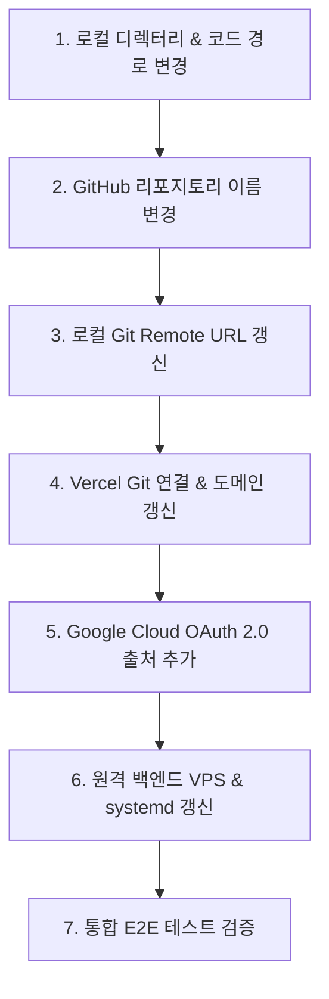

# 📘 프로젝트 명칭 변경 & 클라우드 풀스택 동기화 완벽 가이드 (Project Rename & Full-Stack Sync Guide)

프로젝트 이름이 변경되었을 때 **로컬 PC &rarr; GitHub &rarr; Vercel &rarr; Google Cloud OAuth &rarr; 원격 백엔드 서버(VPS)** 전체 인프라를 실수 없이 완벽하게 일괄 동기화하는 엔드투엔드(End-to-End) 운영 매뉴얼입니다.

---

## 🗺️ 전체 동기화 워크플로우 한눈에 보기



---

## 🛠️ 단계별 상세 절차 & 실수 방지 가이드

### STEP 1. 로컬 워크스페이스 & 코드베이스 정리

1. **디렉터리 안전 이전 (Windows 프로세스 락 회피)**:
   - VS Code나 백그라운드 프로세스가 파일 핸들을 잡고 있으면 일반 폴더 이름 변경(`Rename-Item`) 시 `PermissionError`가 발생합니다.
   - `robocopy /E` 명령어로 새 폴더명(`stockRecommend`)에 소스, `.git`, `venv`를 복제한 후 구형 폴더를 정리하는 방식이 가장 안전합니다.
2. **설정 및 배치 스크립트 갱신**:
   - `run_pipeline.bat`: `PROJECT_DIR=c:\Users\samsung\proj\stockRecommend` 수정
   - `.vercel/project.json`: `"projectName": "stockrecommend"` 수정
3. **오타 및 이전 경로 전수 치환**:
   - `README.md`, `docs/`, `scratch/*.py` 내의 모든 `file:///` 절대 경로 및 URL 치환

---

### STEP 2. GitHub 저장소 이름 변경 & 로컬 Git 동기화

1. **GitHub 웹에서 이름 변경**:
   - GitHub 저장소 접속 &rarr; **Settings** &rarr; **Repository name**을 `stockRecommend`로 변경 후 **Rename** 클릭
2. **로컬 Git 원격 주소 갱신**:
   - 로컬 터미널에서 다음 명령어를 실행하여 새 주소를 바라보도록 설정합니다:
     ```bash
     git remote set-url origin https://github.com/<사용자ID>/stockRecommend.git
     git remote -v
     git fetch origin
     ```

---

### STEP 3. Vercel 프론트엔드 호스팅 & CLI 자동 배포 (No-Dashboard) 💻

웹 대시보드 접속 없이 **Vercel CLI 명령어**로 즉시 배포 및 도메인 바인딩이 가능합니다.

#### 🥇 방법 A: Vercel CLI 원클릭 배포 (가장 빠름 - 웹 접속 불필요)
```bash
# 1. 로컬 코드를 프로덕션으로 즉시 직통 배포 (10초 소요)
npx vercel --prod --yes

# 2. 도메인을 CLI에서 즉시 프로젝트에 연결
npx vercel domains add stockrecommend.vercel.app

# 3. (옵션) VERCEL_TOKEN을 사용하는 무인 자동 배포
npx vercel --prod --yes --token <VERCEL_TOKEN>
```

#### 🥈 방법 B: GitHub Webhook 연동 방식
1. **Vercel Git 연결 갱신**:
   - Vercel 대시보드 &rarr; **Settings** &rarr; **Git** 이동 &rarr; **`bhlim92/stockRecommend`** 재연결
2. **도메인 연결**:
   - **Settings** &rarr; **Domains** 이동 &rarr; `stockrecommend.vercel.app` 추가
3. **⚠️ 주의: `Redeploy` 버튼의 함정**:
   - 과거 배포 상자의 `Redeploy` 버튼은 최신 코드가 아닌 "해당 상자의 과거 커밋"을 재빌드합니다. 최신 반영을 위해서는 반드시 **새 커밋 푸시** 또는 **CLI 배포(`npx vercel --prod`)**를 사용해야 합니다.

---

### STEP 4. Google Cloud Console OAuth 2.0 출처 승인

도메인이 `stockrecommend.vercel.app`로 바뀌면 구글 로그인 시 **`400 오류: origin_mismatch`**가 발생합니다.

1. **올바른 Google Cloud 프로젝트 선택**:
   - [Google Cloud Console](https://console.cloud.google.com/apis/credentials) 상단 프로젝트 드롭다운에서 **현재 클라이언트 ID(예: `412232683452...`)가 생성된 올바른 프로젝트**가 선택되어 있는지 확인합니다.
2. **승인된 자바스크립트 원본 추가**:
   - 해당 **OAuth 2.0 클라이언트 ID** 클릭
   - **승인된 자바스크립트 원본 (Authorized JavaScript origins)** &rarr; **[URI 추가]**:
     ```text
     https://stockrecommend.vercel.app
     ```
   - **승인된 리디렉션 URI (Authorized redirect URIs)** &rarr; **[URI 추가]**:
     ```text
     https://stockrecommend.vercel.app
     https://stockrecommend.vercel.app/login.html
     ```
   - 맨 아래 **[저장 (Save)]** 클릭 (반영에 1~2분 소요)

---

### STEP 5. 원격 상주 백엔드 서버(VPS) 동기화

원격 서버(Linux VPS)의 서비스 및 스케줄러도 함께 변경해야 배포 불일치가 발생하지 않습니다.

1. **서버 디렉터리 이전**:
   ```bash
   mv /root/stockRecommnad /root/stockRecommend
   ```
2. **systemd 서비스 파일 갱신 (`/etc/systemd/system/stock-recommend.service`)**:
   ```ini
   [Unit]
   Description=FastAPI Web Server for Stock Discovery and Portfolio Rebalancing
   After=network.target mariadb.service

   [Service]
   User=root
   WorkingDirectory=/root/stockRecommend
   ExecStart=/root/stockRecommend/venv/bin/python -m uvicorn app.web_server:app --host 0.0.0.0 --port 8000
   Restart=always
   RestartSec=5
   Environment=PATH=/root/stockRecommend/venv/bin:/usr/local/sbin:/usr/local/bin:/usr/sbin:/usr/bin:/sbin:/bin

   [Install]
   WantedBy=multi-user.target
   ```
3. **서비스 재기동 및 Crontab 스케줄러 갱신**:
   ```bash
   systemctl daemon-reload
   systemctl enable stock-recommend.service
   systemctl restart stock-recommend.service
   
   # Crontab 경로 갱신
   # 0 6 * * * /root/stockRecommend/run_pipeline.sh > /dev/null 2>&1
   ```

---

## 📋 실수 방지 체크리스트 (Self-Audit Checklist)

배포 및 이름 변경 완료 후 다음 항목을 순서대로 점검하세요:

- [ ] **로컬 테스트 통과**: `pytest tests/` 77개 테스트 전체 통과 확인
- [ ] **Git Remote 확인**: `git remote -v`가 새 저장소 주소를 가리키는지 확인
- [ ] **Vercel Git 연결 확인**: Vercel Settings > Git에 새 리포지토리가 `Connected` 상태인지 확인
- [ ] **Vercel 커밋 해시 일치**: Vercel의 `Ready Latest` 배포본 커밋 해시가 로컬 최신 `git log`와 일치하는지 확인
- [ ] **구글 OAuth 승인**: `https://<새도메인>.vercel.app`에서 구글 로그인 시 400 에러 없이 대시보드 진입되는지 확인
- [ ] **원격 VPS API 통신**: Vercel 대시보드에서 퀀트 스크리너 데이터 및 포트폴리오가 정상 로딩되는지 확인
