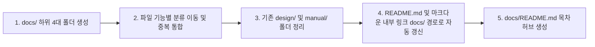

# 📚 프로젝트 문서 체계 단일화 및 통합 방안 (Documentation Unification Proposal)

현재 프로젝트 루트에 분산되어 있는 `design/`, `docs/`, `manual/` 폴더를 체계적이고 직관적인 **단일 통합 문서 저장소(`docs/`)** 체계로 일원화하는 통합 설계안입니다.

---

## 🔍 1. 현재 분산 현황 및 문제점 분석

| 현재 폴더 | 포함된 파일 | 문제점 |
| :--- | :--- | :--- |
| **`design/`** (14개 파일) | 아키텍처, UI 설계, 퀀트 규칙, 배포 계획, QA 보고서, 봇 가이드 등 혼재 | 설계서뿐만 아니라 매뉴얼, 보고서, PPTX 등이 한 폴더에 혼재되어 탐색성 저하 |
| **`manual/`** (1개 파일) | `telegram_bot_guide.md` (3.3KB) | `design/telegram_bot_guide.md`와 내용이 중복되어 관리 포인트 분산 |
| **`docs/`** (1개 파일) | `v3.3_bug_fix_report.md` (2.4KB) | 과거 버그 픽스 보고서 1개만 고립되어 존재 |

---

## 🏛️ 2. 추천 통합 디렉터리 구조 (`docs/` 표준 체계)

모든 프로젝트 문서를 표준적인 **`docs/`** 루트 아래 4대 핵심 분류 체계로 일원화합니다.

```text
docs/
├── README.md                      # 📖 전체 문서 목차 (Documentation Index & Sitemap)
│
├── 1_architecture/                # 🏛️ [아키텍처 & 팀 R&R]
│   ├── system_architecture.md     # 시스템 전체 구조 및 컴포넌트 흐름도
│   ├── system_architecture.pptx   # 전체 아키텍처 PPTX 설계서
│   ├── TEAM_ROLES.md              # AI 에이전트 팀원별 R&R 및 협업 규칙
│   └── implemented_features.md    # 기구현 기능 매핑 명세표
│
├── 2_design/                      # 🎨 [모듈별 상세 설계서]
│   ├── UI_DESIGN.md               # 프론트엔드 HSL 디자인 시스템 & CSS 토큰
│   ├── screener_scoring_rules.md  # CANSLIM 퀀트 스코어링 규칙 명세
│   ├── screener_scoring_rules.pptx# 퀀트 스코어링 PPTX 설명 자료
│   ├── screener_realtime_design.md# 2.0초 폴링 & 실시간 리더보드 연동 설계
│   └── REPORT_SEARCH_FEATURE.md   # [신규] 일일 리포트 웹 검색 시스템 설계서
│
├── 3_manual/                      # 📘 [운영, 배포 및 사용자 매뉴얼]
│   ├── deployment.md              # VPS 배포, 윈도우 스케줄러, 로깅 및 장애 복구 가이드
│   └── telegram_bot_guide.md      # 텔레그램 봇 설정, 명령어 및 원격 승인 가이드 (통합본)
│
└── 4_reports/                     # 📊 [QA 검증 및 변경 이력 보고서]
    ├── screener_integration_qa.md # 실시간 스크리너 QA 감사 보고서
    ├── v3.3_bug_fix_report.md     # v3.3 배포 버그 수정 보고서
    ├── EXPERT_PLAN_REVIEW.md      # 전문가 패널 검토 보고서
    ├── implementation_plan.md     # 마이그레이션 실행 계획서
    └── walkthrough.md             # 마이그레이션 완료 결과 보고서
```

---

## 💡 3. 통합 시 주요 장점

1. **단일 진입점(Single Entry Point) 확립**:
   - `docs/README.md` 하나만 열면 아키텍처, 설계, 매뉴얼, 보고서로 원클릭 이동 가능
2. **중복 문서 완전 제거**:
   - `manual/`과 `design/`에 분산되어 있던 `telegram_bot_guide.md`를 최신 버전으로 단일화
3. **용도별 명확한 분리**:
   - 설계서(Design), 사용자/운영자 가이드(Manual), 감사 보고서(Reports)가 명확히 분리되어 개발자/운영자의 문서 접근성 향상
4. **README.md 및 코드 내 링크 일관성**:
   - 루트 `README.md`에서 모든 참조 경로를 `docs/...` 체계로 깔끔하게 정리

---

## 📋 4. 마이그레이션 실행 절차 (승인 시 즉시 적용)



1. `docs/1_architecture/`, `docs/2_design/`, `docs/3_manual/`, `docs/4_reports/` 디렉터리 생성
2. 기존 16개 파일을 카테고리별로 이동 및 `telegram_bot_guide.md` 단일화
3. `design/`, `manual/` 잔여 폴더 정리
4. 프로젝트 전반의 마크다운 링크를 새 `docs/...` 경로로 일괄 치환
5. 전체 문서를 한눈에 볼 수 있는 `docs/README.md` 인덱스 허브 생성
