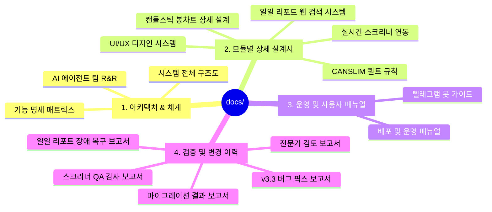

# 📚 stockRecommend 통합 문서 센터 (Documentation Hub)

`stockRecommend` 주식 발굴 및 포트폴리오 리밸런싱 시스템의 전체 설계서, 아키텍처, 사용자/운영자 매뉴얼 및 품질 감사 보고서를 집대성한 통합 문서 저장소입니다.

---

## 🗺️ 전체 문서 목차 & 사이트맵 (Sitemap)

---

### 🏛️ 1. 아키텍처 및 체계 (Architecture)
시스템의 고수준 구조, 네트워크 흐름, 에이전트 R&R을 정의합니다.

* [**system_architecture.md**](file:///c:/Users/samsung/proj/stockRecommend/docs/1_architecture/system_architecture.md): 전체 소프트웨어 아키텍처, 네트워크 연동 흐름, 컴포넌트 관계도
* [**system_architecture.pptx**](file:///c:/Users/samsung/proj/stockRecommend/docs/1_architecture/system_architecture.pptx): 시각화된 전체 시스템 아키텍처 파워포인트 슬라이드
* [**TEAM_ROLES.md**](file:///c:/Users/samsung/proj/stockRecommend/docs/1_architecture/TEAM_ROLES.md): AI 에이전트 팀원(Core Developer, QA, UI Designer 등)의 역할, 책임 및 협업 워크플로우
* [**implemented_features.md**](file:///c:/Users/samsung/proj/stockRecommend/docs/1_architecture/implemented_features.md): 전체 20여 개 구현 기능의 상세 사양 및 소스 파일 매핑 매트릭스

---

### 🎨 2. 모듈별 상세 설계서 (Design Specifications)
프론트엔드 UI, 퀀트 알고리즘 및 신규 기능의 기술 스펙을 정의합니다.

* [**UI_DESIGN.md**](file:///c:/Users/samsung/proj/stockRecommend/docs/2_design/UI_DESIGN.md): HSL 네온 테크 테마 디자인 토큰, 컴포넌트 스타일 및 반응형 레이아웃 가이드
* [**screener_scoring_rules.md**](file:///c:/Users/samsung/proj/stockRecommend/docs/2_design/screener_scoring_rules.md): CANSLIM 성장성, 재무 지표 및 기술적 보조지표(RSI/MACD) 퀀트 점수 산출 로직
* [**screener_scoring_rules.pptx**](file:///c:/Users/samsung/proj/stockRecommend/docs/2_design/screener_scoring_rules.pptx): 퀀트 스코어링 규칙 시각화 슬라이드
* [**screener_realtime_design.md**](file:///c:/Users/samsung/proj/stockRecommend/docs/2_design/screener_realtime_design.md): 2.0초 폴링, 실시간 Top 15 리더보드 및 CORS/SameSite 연동 설계서
* [**REPORT_SEARCH_FEATURE_DESIGN.md**](file:///c:/Users/samsung/proj/stockRecommend/docs/2_design/REPORT_SEARCH_FEATURE_DESIGN.md): SQLite FTS5 기반 일일 투자 리포트 웹 전문 검색 시스템 설계서
* [**MULTI_USER_AUTH_DESIGN.md**](file:///c:/Users/samsung/proj/stockRecommend/docs/2_design/MULTI_USER_AUTH_DESIGN.md): [신규] 다중 사용자 화이트리스트 및 역할 기반 접근 제어(RBAC) 시스템 설계서
* [**SCREENER_CANDLESTICK_CHART_DESIGN.md**](file:///c:/Users/samsung/proj/stockRecommend/docs/2_design/SCREENER_CANDLESTICK_CHART_DESIGN.md): [신규] AI 종목 스크리너 캔들스틱(봉차트) 전환 및 OHLCV 복합 렌더링 상세 설계서

---

### 📘 3. 운영 및 사용자 매뉴얼 (Manuals & Guides)
서버 배포, 윈도우 스케줄러 자동화, 모바일 텔레그램 원격 제어 및 인프라 동기화 가이드입니다.

* [**deployment.md**](file:///c:/Users/samsung/proj/stockRecommend/docs/3_manual/deployment.md): Cafe24 VPS/Vercel 배포, Task Scheduler 자동화 등록, 로그 로테이션 및 장애 복구 가이드
* [**telegram_bot_guide.md**](file:///c:/Users/samsung/proj/stockRecommend/docs/3_manual/telegram_bot_guide.md): 텔레그램 봇 설정, 명령어(`/system`, `/screener`, `/cmd`) 및 원격 인라인 승인 가이드
* [**PROJECT_RENAME_SYNC_GUIDE.md**](file:///c:/Users/samsung/proj/stockRecommend/docs/3_manual/PROJECT_RENAME_SYNC_GUIDE.md): [필독] 프로젝트명 변경 시 GitHub, Vercel, Google OAuth, VPS 풀스택 동기화 매뉴얼

---

### 📊 4. 검증 및 변경 이력 보고서 (Reports & Change History)
QA 테스트 감사, 버그 수정 내역 및 시스템 변경 이력 보고서입니다.

* [**screener_integration_qa_report.md**](file:///c:/Users/samsung/proj/stockRecommend/docs/4_reports/screener_integration_qa_report.md): 실시간 스크리너 통합 QA 감사 및 버그 분석 보고서
* [**v3.3_bug_fix_report.md**](file:///c:/Users/samsung/proj/stockRecommend/docs/4_reports/v3.3_bug_fix_report.md): v3.3 릴리즈 당시의 버그 픽스 내역
* [**daily_report_generation_recovery_report.md**](file:///c:/Users/samsung/proj/stockRecommend/docs/4_reports/daily_report_generation_recovery_report.md): [신규] 일일 투자 보고서 생성 장애 원인 분석 및 복구 보고서
* [**EXPERT_PLAN_REVIEW.md**](file:///c:/Users/samsung/proj/stockRecommend/docs/4_reports/EXPERT_PLAN_REVIEW.md): 전문가 패널(개발자, QA, 인프라, 테크니컬 라이터) 종합 검토 보고서
* [**implementation_plan.md**](file:///c:/Users/samsung/proj/stockRecommend/docs/4_reports/implementation_plan.md): 표준 명칭 마이그레이션 구현 계획서
* [**walkthrough.md**](file:///c:/Users/samsung/proj/stockRecommend/docs/4_reports/walkthrough.md): 마이그레이션 실행 및 77개 테스트 100% 통과 결과 보고서
* [**DOCUMENTATION_UNIFICATION_PROPOSAL.md**](file:///c:/Users/samsung/proj/stockRecommend/docs/4_reports/DOCUMENTATION_UNIFICATION_PROPOSAL.md): 통합 문서 체계 수립 제안서
